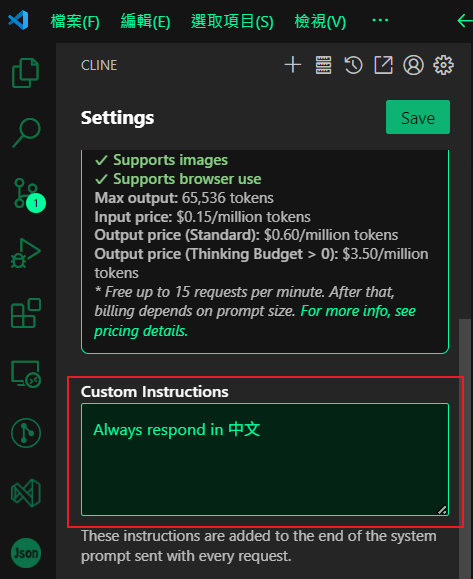

# CLine
CLine 進階實戰開發  

---

CLine 透過 .clinerules 自定義指令，並附上多個範例文件。  

# 開發 prompt 範例

```md!
1. When writing JavaScript, prefer functional programming paradigms over object-oriented approaches where appropriate.
2. When generating documentation, always use Markdown format with clear headings and code blocks.
3. Ensure that all new components follow a microservices architecture and communicate via REST APIs.
4. When generating code that might throw exceptions, always include try-catch blocks and log the errors with descriptive messages.
5. For database operations, use the Postgres MCP server with credentials stored in 1Password under ‘Development > Database’.
6. Always provide the full code implementation without omitting any parts. Ensure the code is complete.
```
翻譯為中文:
```md!
1. 編寫 JavaScript 時，在適當的情況下優先使用函數式程式設計範例而不是物件導向的方法。
2. 產生文件時，請務必使用 Markdown 格式，並帶有清晰的標題和程式碼區塊。
3.確保所有新元件遵循微服務架構並透過 REST API 進行通訊。
4. 產生可能引發異常的程式碼時，請務必包含 try-catch 區塊並使用描述性訊息記錄錯誤。
5. 對於資料庫操作，請使用 Postgres MCP 伺服器，其憑證儲存在 1Password 的「開發 > 資料庫」下。
6. 始終提供完整的程式碼實現，不遺漏任何部分。確保代碼完整。
```

## Custom Instructions(自訂義指令)
  
全域的自定義指令，每次發問會自動合併到上下文中。  
範例如下:  
```md!
Always write comments in Chinese for each function
Where writing JavaScript, prefer function programming paradigms over object-oriented approaches where appropriate
```
翻譯成中文:
```md!
務必為每個函數寫上中文註釋
在編寫 JavaScript 時，在適當的情況下優先使用函數程式設計範式而不是物件導向的方法
```

## .clinerules
目錄下的個別專案 CLine 所使用的 Rules 設定(.clinerules 是一個檔案名時)  
```md!
## 文檔搜索

在需要查詢 Next.js 和 Tailwind CSS 相關文檔時，務必使用 Context7 以獲取最新的、版本相關的文檔信息。

### Next.js 文檔搜索

當需要查詢 Next.js 文檔時，**搜索 Next.js 的穩定版本文檔**。在你的提問中，明確包含 `use context7` 並指明需要 Next.js 的穩定版文檔。例如：

use context7 搜索 Next.js 穩定版關於路由功能的文檔

### Tailwind CSS 文檔搜索

當需要查詢 Tailwind CSS 文檔時，**搜索 Tailwind CSS 的最新版本文檔**。在你的提問中，明確包含 `use context7` 並指明需要 Tailwind CSS 的最新文檔。例如：

use context7 搜索 Tailwind CSS 最新版關於響應式設計的文檔
```
## .clinerules Folder
目錄下的個別專案 CLine 所使用的 Rules 設定  
(.clinerules 是一個目錄名時，目錄裡面允許多個設定檔案)  
### 01-tech-stack.md
[01-tech-stack.md](./.clinerules/01-tech-stack.md)

### 02-project-structure.md
[02-project-structure.md](./.clinerules/02-project-structure.md)

### 03-code-style.md
[03-code-style.md](./.clinerules/03-code-style.md)

### 04-styling.md
[04-styling.md](./.clinerules/04-styling.md)

### 05-ollama-config.md
[05-ollama-config.md](./.clinerules/05-ollama-config.md)

### 06-app-logic.md
[06-app-logic.md](./.clinerules/06-app-logic.md)


### 07-important-files.md
[07-important-files.md](./.clinerules/07-important-files.md)
